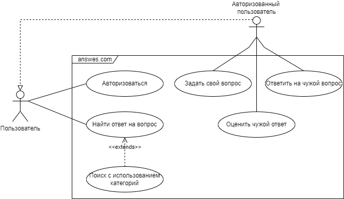

# Лабораторная работа №3 по Тестированию программного обеспечения

<h4><i><b>Вариант №64587:</b> Answers.com. This free reference tool from Answers.com can look up quick answers in a range of authoritative sources, while you're working with any application. - http://www.answers.com/ </i></h4>

<h3>Требования к выполнению работы:</h3>

1. Тестовое покрытие должно быть сформировано на основании набора прецедентов использования сайта.
2. Тестирование должно осуществляться автоматически - с помощью системы автоматизированного тестирования Selenium.
3. Шаблоны тестов должны формироваться при помощи Selenium IDE и исполняться при помощи Selenium RC в браузерах Firefox и Chrome.
4. Предполагается, что тестируемый сайт использует динамическую генерацию элементов на странице, т.е. выбор элемента в DOM должен осуществляться не на основании его ID, а с помощью XPath.

<h3>Выполнение:</h3>
<h4>UseCase-диаграмма</h4>

<h4>CheckList тестового покрытия</h4>
* Тестовый сценарий «Авторизация»:
  1. Успешный вход пользователя
  2. Попытка входа с неверными данными
  3. Выход из учётной записи пользователя
* Тестовый сценарий «Поиск вопроса»:
  1. Найти вопрос с помощью строки поиска
  2. Найти вопрос с использованием категорий
* Тестовый сценарий «Задать вопрос»:
  1. Создать и опубликовать свой вопрос
* Тестовый сценарий «Ответить на вопрос»:
  1. Оставить ответ на вопрос
* Тестовый сценарий «Оценить ответ»:
  1. Оценить ответ положительно
  2. Оценить ответ отрицательно
